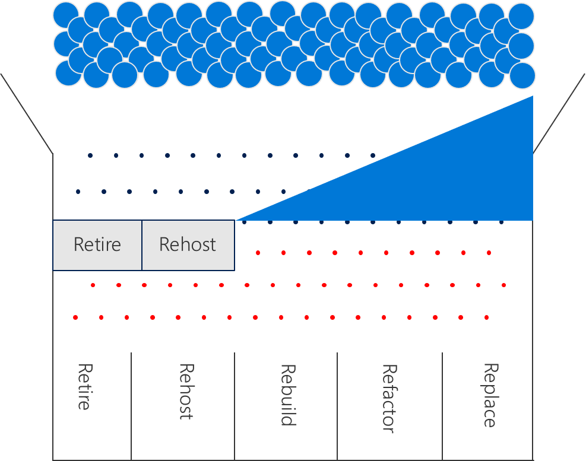
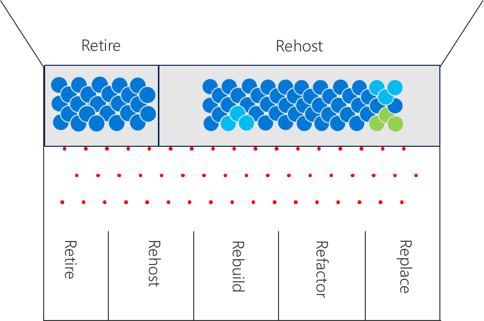
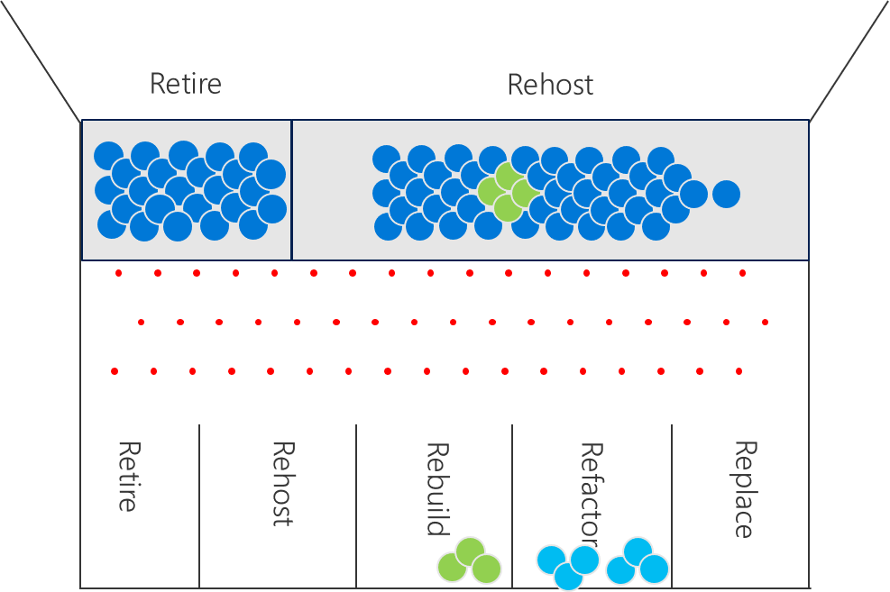
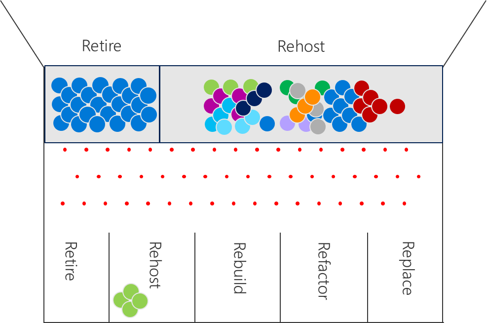
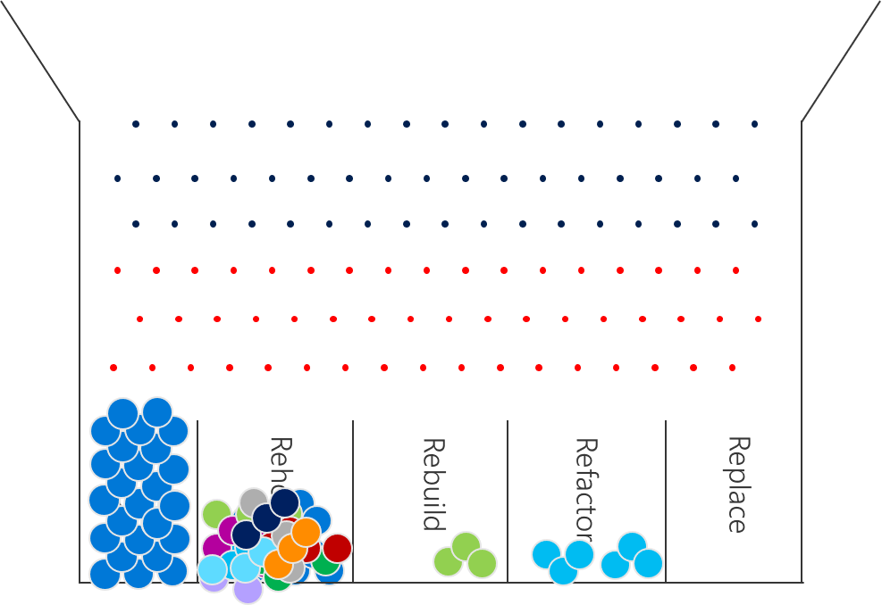

# Fusion: How can cloud rationalization align to business drivers?

This article focuses specifically on aligning the 5 Rs of rationalization to business drivers in a faster, incremental approach to rationalization. It is assumed that the reader has reviewed the article on [traditional rationalization](rationalize.md) to gain an understanding of rationalization Plinko. It is also assumed that the reader understands the [Transformation Journey](../transformation-journeys/overview.md) that best aligns with the current effort that is requiring this rationalization.

## Incremental Rationalization: Reducing Complexity

This section of the article outlines the pieces needed to start an incremental rationalization process.

*Figure 1. Rationalization as a plinko board with reduced options*

**Inventory:** Its hard to make decisions without an inventory. However, the inventory process can be streamlined based on the business outcomes. See learning metrics to align inventory to the most important data points.

**Quantitative analysis:** Each black peg in the image above represents a quantitative question: Is the asset used? If so, is it optimized and sized properly? These two questions are needed to properly size and make a few base assumptions about retirement and sizing. The answers to each will directly drive the financial model.

**Streamline Initial Decisions:** By reducing the options, it’s easier to get to an initial decision regarding the future state of an asset. In this example, the customer is on an Operational Transformation journey that focuses on reducing costs. As such the options are simple: Re-host (& resize) to match current state utilization – or – Retire the unused asset.

> [!NOTE]
> This streamlined approach produces baselines, financial plans, strategy, & direction. In later activities, like the Assess & Architect phases of a migration process, each asset would go through further rationalization and qualitative analysis to evaluate other options.
> [!NOTE]
> As outlined in the article on [learning metrics](../business-strategy/learning-metrics.md), different business outcomes would result in a different set of streamlined options. Incremental Transformations that focus on customer experience over cost savings would focus on Retire or Refactor options. Disruptive Transformations that focus on data and new products/services are more likely to focus on Rebuild or Replace.

## Incremental Rationalization: Challenge assumptions

The outcome of the prior section is a rough rationalization loaded with assumptions. Next, its time to challenge some of those assumptions.

*Figure 2. Rationalization as a plinko board after challenging basic assumptions.*

**Retire:** In a traditional on-prem environment, hosting small, unused assets seldom generates a significant impact on annual costs. With a few exceptions, the cost savings associated with pruning and retiring those assets is outweighed by the FTE effort required to analyze and retire the actual asset.

However, when moving to a cloud accounting model, retiring assets can produce significant savings in annual operating costs and up-front migration efforts.

It is not uncommon for organizations to retire 30%+ of their digital estate after the completion of a quantitative analysis. Additional qualitative analysis is suggested before acting. Once confirmed, the retirement of those assets can produce the first ROI victory in the cloud migration. In many cases, this is the biggest cost saving factor. As such, it is suggested that the Cloud Strategy Team oversee the validation and retirement of assets in parallel to the Build Phase of the migration process.

**Program Adjustments:** Seldom is a company embarking on just one transformation journey. The choice between cost reduction, market growth, and new revenue streams is seldom a binary decision. As such, it is suggested that the Cloud Strategy Team work with IT to identify assets that are on parallel transformation efforts that are outside of the scope of the primary Transformation Journey.

In the Operational Transformation example used in this article:

* Ask the DevOps team to identify assets that are already part of a deployment automation and move those to Refactor.
* Ask the Data and R&D teams to identify assets that are powering new revenue streams and move them to Rebuild.

This qualitative analysis can be executed quickly & will create alignment in the migration backlog.

> [!NOTE]
> Some assets may still need to be treated like Re-host assets for a period of time, phasing in later rationalization, after the initial migration.

## Incremental Rationalization: Selecting the First Workload

Implementing the first workload is key to testing and learning. It is the first opportunity to demonstrate and build a growth mindset.

*Figure 3. Rationalization as a plinko board after the first workload*

**Business Criteria:** Identify a workload that is supported by a member of the Cloud Strategy Team’s business unit to ensure business transparency. Preferably one in which the team has a vested stake and motivation to move to the cloud.

**Technical Criteria:** Select a workload that has minimum dependencies and can be moved as a small group of assets. It is suggested that a workload with a defined testing path be selected to ease validation.

> [!NOTE]
> The first workload is often deployed in an experimental environment with no operational or governance capacity. It is very important to select a workload that does not interact with secure data. 

**Qualitative Analysis:** The Cloud Adoption Team and Cloud Strategy Team can work together on the analysis of this small workload. This creates a controlled opportunity to create and test qualitative analysis criteria. The smaller population creates an opportunity to survey the impacted users in an effort to complete a detailed qualitative analysis in a week or less.

**Migration:** In parallel to continued rationalization, the Cloud Adoption Team can begin migrating the small workload to expand learning in the following key areas:

* Strengthen skills with the cloud provider’s platform
* Define the Core services (& Azure Standards) needed to fit the long term vision
* Better understand how operations may need to evolve later in the transformation

## Incremental Rationalization: Release Planning

While the Cloud Adoption Team is executing the migration or implementation of the first workload, the Cloud Strategy Team can begin prioritizing the remaining applications/workloads.

*Figure 4. Rationalization as a plinko board after a few releases*

**Power of Ten:** The traditional approach to rationalization attempts to boil the ocean. Fortunately, a plan for every application is often not required to start a transformation journey. In an incremental model, the Power of Ten provides a good starting point. In this model, the cloud strategy team selects the first 10 applications to be migrated. Those 10 workloads should contain a mixture of simple and complex workloads. For guide to choosing a simple workload review the First Workload article.

**Building the first backlogs:** The Cloud Adoption Team and Cloud Strategy Team can work together on the qualitative analysis for the first 10 workloads. This creates the first prioritized migration backlog and the first prioritized release backlog. This approach allows the teams to continue to iterate on the approach taken for adequate qualitative analysis.

**Maturing the process:** Once qualitative analysis criteria are agreed upon between the two teams, the process of assessment can become a task within each iteration. Analysis criteria agreement usually requires 2-3 releases.

Once the assessment is moved into the incremental execution processes of migration, the Cloud Adoption Team can iterate on assessment and architecture faster. At this stage, the Cloud Strategy Team is also abstracted, reducing the drain on their time. This also allows the Cloud Strategy Team to remain focused on prioritization of the applications that are not yet in a specific release, thus ensuring tight alignment with changing market conditions.

> [!NOTE]
> Not all ten of the prioritized applications will be ready for migration. Sequencing is likely to change, as the team performs qualitative analysis.

> [!NOTE]
> Some releases may group together a small number of workloads. Others may just be a single workload.

> [!NOTE]
> The Cloud Adoption Team is likely to run iterations that don’t produce a complete workload migration. The smaller the workload & the less dependencies, the more likely a workload is to fit into a single sprint or iteration.

## Incremental Rationalization: End State

As time progresses, the combination of the Cloud Adoption Team and the Cloud Strategy Team will complete a full rationalization of the inventory. However, this incremental approach will allow the team to get continually faster at the rationalization process. It will also allow the Transformation Journey to yield tangible business results sooner, without as large of an upfront analysis effort.

*Figure 5. Rationalization end result*

> [!NOTE]
>In some cases, the financial model may be too tight to make a decision to act, without additional rationalization. In such cases, a more traditional approach to rationalization may be required.

## Next steps

The output of a rationalization effort is a prioritized backlog of all assets to be impacted by the chosen transformation.

This backlog is now ready to serve as the foundation for [costing models of cloud services](calculate.md).

> [!div class="nextstepaction"]
> [Price calculations for cloud services](calculate.md)