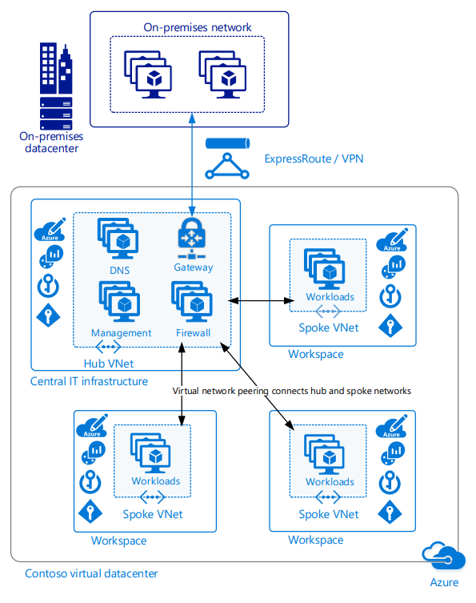

# Enterprise Cloud Adoption: Software Defined Networks - Virtual datacenters

A virtual datacenter architecture is designed to assist enterprises in
deploying a large number of workloads to public cloud platform while still
preserving key aspects of existing access control, policy compliance, and
governance across your entire organization. Building off the connectivity
provided by the hybrid cloud model, a virtual datacenter adds management, access
control, and traffic management capabilities.

The most common virtual datacenter model is built around a hub and spoke
arrangement composed of multiple virtual networks. These networks can be hosted on separate accounts or subscriptions, allowing VDCs to bypass resource limits.

The virtual datacenter model supports connecting hub and spoke networks across geo-regions. However, connecting between geo-regions has the potential to introduce higher latency than would be the case if all networks were in the same geo-region, and this potential latency would need to be accounted for in your network and workload planning.

The central hub virtual network
contains the main traffic management, policy rules, and monitoring resources for the virtual datacenter. The hub hosts a connection to on-premises or other external networks and contains the central routing and firewall capabilities that manage traffic coming from workloads to external networks and vice versa. The hub also hosts any other common shared services used by workloads across the VDC.

Workload spokes are separate virtual networks that, aside from network peering with the hub network, are isolated by default. All traffic travelling to the spoke from outside the VDC and form the spoke to the outside world are forced to travel through the hub where central security rules and access policies are applied. Much of the control over the spoke networks and connected workload resources can be delegated to the workload teams themselves, while critical security and access controls can be maintained through the central hub.

**Virtual Datacenter Assumptions:** Deploying a virtual datacenter assumes the following:

- Your cloud migration will contain large number of assets and may be exceeding the number of resources allowed within a single account or subscription.
- You have a common identity system between your on-premises and cloud environments.
- The complexity of your deployment requires the central IT management provided by the virtual datacenter hub and spoke networking model.
- You will need to support agile deployment of workloads in support of developer and operations teams, while maintaining common policy and governance compliance.
- You need a security model that allows central IT control over core services and security coupled with delegated control of workload resources.

> [!TIP]
> A virtual datacenter is more than networking functionality. Implementing this model requires integrating requirements from enterprise IT, security, governance, and developer teams. For simpler or smaller hybrid deployments a virtual datacenter model is likely more complicated than necessary. 

## Next steps

Learn more about [software defined networking](overview.md).

> [!div class="nextstepaction"]
> [Software Defined Networking](overview.md)

## Azure Virtual Data Center - Enterprise scale cloud network extension

The [Azure Virtual Data Center
(VDC)](https://docs.microsoft.com/en-us/azure/architecture/vdc/) is an approach
designed to assist enterprises in deploying large number of workloads and
services to the Azure public cloud platform while still preserving key aspects
of your existing security, policy compliance, and general IT governance
practices. The goal of VDC guidance is to show you how to build a trusted
network extension integrating organizational governance, policy, and management
practices across both on-premises and cloud-based components of your IT estate.

As with other hybrid clouds, the VDC hub network hosts a connection to
on-premises or other external networks (via ExpressRoute or VPN) and contains
the UDR, NVA and other routing and security devices to manage traffic coming
from workloads to external on-premises networks and vice versa.

A single hub can connect to many spokes, and each hub and spoke virtual network
exist in separate subscriptions, mitigating some of the subscription level
limits that can affect large cloud migrations.

Note that the VDC networking architecture is just a part of the overall virtual
data center concept, which includes integrating your enterprise's existing
governance, identity and access control, and security policies into your cloud
migration. See the [Azure Virtual Datacenter
E-book](https://azure.microsoft.com/en-us/resources/azure-virtual-datacenter/)
for more information on the broader concepts behind VDC and the trusted network
extension.

## Next steps

Learn  how [monitoring and reporting](../logs-and-reporting/vdc-monitoring.md) are used to maximize policy compliance of workloads and resources host in an Azure Virtual Datacenter.

> [!div class="nextstepaction"]
> [Azure Vitual Datacenter: Monitoring, Reporting, and Compliance](../logs-and-reporting/vdc-monitoring.md)