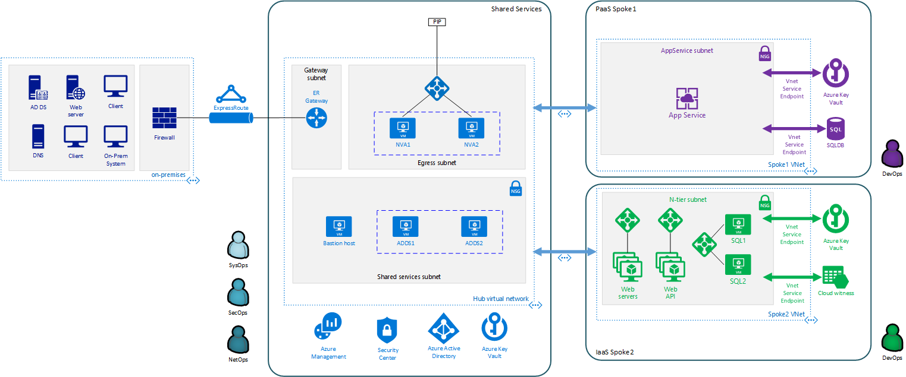

# Fusion: Azure Virtual Datacenter (VDC) Model

This section of the [Fusion framework](../../overview.md) guides you through the process and associated considerations when deploying workloads to Azure using the Azure Virtual Datacenter (VDC) model.

VDC is a term coined by Mark Ozur, Hatay Tuna, Callum Coffin, and Telmo Sampaio from the Azure Customer Advisory Team (AzureCAT), in the eBook "[Azure Virtual Datacenter](https://azure.microsoft.com/en-us/resources/azure-virtual-datacenter/)".

Virtual Datacenter is an approach for deploying your applications and workloads in a cloud-based architecture while preserving key aspects of your current IT governance and taking advantage of cloud computing’s agility. The goal in implementing a VDC is to provide similar governance capabilities on large Azure deployments as you would have in a traditional datacenter. At the same time, the VDC model allows teams within your organization to deploy individual workloads with the agility and flexibility common to Azure solutions, while still adhering to central IT policies.

*Abstract view of the VDC model's hub and spoke structure*

The VDC expands upon the existing [hub-spoke networking model](https://docs.microsoft.com/en-us/azure/architecture/reference-architectures/hybrid-networking/hub-spoke) to provide connectivity between isolated workload networks and a centrally managed hub network. The hub environment controls traffic to and from the workloads and the on-premises environment and controls any access to workloads from the internet.

Governing your workloads requires integrating management processes, regulatory requirements, and security processes within a cloud environment. In support of governance requirements, the VDC model provides basic guidance on implementing an organization's separation of roles, responsibilities, and policies in the cloud.  

### VDC Assumptions

Embedded in the Azure Virtual Datacenter model is a core set of assumptions. If your cloud migration requirements align with these assumptions, VDC guidance and associated resources can significantly reduce the time required to build out a large Azure deployment compliant with your organizations governance policy. However, even if these assumptions don't match your specific deployment scenarios, the VDC approach provides a logical way of thinking about complex, interconnected cloud-based solutions.

These assumptions include:

- You will need to securely access cloud-based resources with your on-premises environment using [hybrid networking](../software-defined-networks/hybrid.md).
- Your cloud estate will contain large number of assets and may exceed the number of resources [allowed within a single subscription](https://docs.microsoft.com/en-us/azure/azure-subscription-service-limits), or your subscription design aims to segment workloads into separate subscriptions based on security or accounting requirements. If your deployments can exist within a single subscription a VDC structure is likely unnecessary.
- The data stored on your cloud deployment is sensitive and needs to be secured using [encryption](../encryption/overview.md) in transit and at rest. Public data does not benefit from encryption.
- Your on-premises identity services are compatible with Azure AD-based [identity federation](../identity/overview.md#federation-vdc).
- Your workloads will be compatible with cloud-based authentication methods such as AML and oAuth/OpenID connect. Legacy authentication methods like Kerberos or NTLM are not incorporated in the VDC model by default and need to be provisioned separately. 

## Fusion framework infrastructure and VDC

The [Infrastructure section](../overview.md) of the [Fusion framework](../../overview.md), describes the components required to migrate core infrastructure services to Azure. VDC is built on these core services, and each of the following topics discuss how the VDC model uses these services to implement create a secure cloud network extension compliant with your organization's governance requirements: 

- [Subscription design and VDC](../subscriptions/vdc-subscriptions.md)
- [Identity and roles in VDC](../identity/vdc-identity.md)
- [Resource grouping in VDC](../resource-grouping/vdc-resource-grouping.md)
- [Azure Policy and VDC](../policy-enforcement/vdc-policy-enforcement.md)
- [VDC naming and tagging recommendations](../resource-tagging/vdc-naming.md)
- [VDC networking architecture](../software-defined-networks/vdc-networking.md)
- [Encryption in VDC](../encryption/vdc-encryption.md)
- [VDC reporting, monitoring and compliance](../logs-and-reporting/vdc-monitoring.md)

## Azure Virtual Datacenter structure

The Azure Virtual Datacenter model requires a common Azure AD tenant [associated will all Azure subscriptions](../subscriptions/vdc-subscriptions.md#subscription-requirements) connected to the VDC. It's assumed that this tenant is [federated with your on-premises identity provider](../identity/vdc-identity.md) so that you can use a common set of users, groups, and roles across your organization.

The VDC model breaks down the central IT teams into [three primary roles](../identity/vdc-identity.md#roles-and-rbac): Security Operations (SecOps), Network Operations(NetOps), and System Operations(SysOps). To support centralized IT control over core security, policy, and networking features, and also to encourage separation of duties among IT staff, RBAC is used to assign these groups access to appropriate pieces of the VDC environment.

[Connectivity to your on-premises environment](../software-defined-networks/vdc-networking#azure-virtual-datacenter-network-architecture) is provided through either an [ExpressRoute circuit](https://docs.microsoft.com/en-us/azure/expressroute/expressroute-introduction) or [Azure VPN gateway](https://docs.microsoft.com/en-us/azure/vpn-gateway/vpn-gateway-about-vpngateways). 

The central hub environment and each workspace spoke are intended to be created in separate Azure subscriptions. This policy decision is intended to increase workload flexibility and avoid subscription-related limits. Each hub and spoke subscription is associated with the main organizational Azure AD tenant, but teams can also set up additional workspace-specific access controls and policies. However, enforcement of global organizational policies is maintained on all subscriptions.

Within subscriptions, the [VDC model organizes resource groups](../resource-grouping/vdc-resource-grouping.md) around functionality, and provides [tagging and naming recommendations](../resource-tagging/vdc-naming.md) to support efficient operational management of VDC-hosted resources.

[Azure Policy rules are applied](../policy-enforcement/vdc-policy-enforcement.md) at both the subscriptions and resource group level. These policy rules impose limitations on what resources can be created in what sections of the VDC, as well as enforcing encryption on all Azure Storage accounts hosted in the VDC.  

*Sample VDC structure, showing major components of hub and spoke environments.*

### Hub components

*details to come *

    Identity and roles
    Operations
    Key Vault
    Networking
        Hub network
        On-premises connectivity
        Peering
        The central firewall
    Management
    Shared services
    

### Spoke Components

*details to come *

    Identity and roles
    Operations
    Key Vault
    Networking
        Spoke network
        Peering

## Azure Virtual Datacenter Automation Toolkit

The Azure Virtual Datacenter Automation Toolkit [public link needed] provides a set of templates and scripts you can use to create a fully functional, trusted network extension to your on-premises IT infrastructure.

## Next steps

See more [guidance and examples](../overview.md#azure-examples-and-guidance) on how to use core infrastructure components in the Azure cloud.

> [!div class="nextstepaction"]
> [Azure Examples and Guidance](../overview.md#azure-examples-and-guidance) 