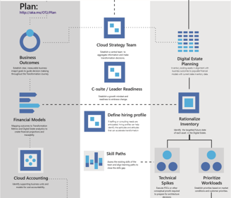

# Enterprise Cloud Adoption: Plan an Operational Transformation Journey (OTJ)

[Operational Transformation](overview.md) is one of the [Transformation Journeys](../overview.md) included in the [Enterprise Cloud Adoption (ECA) framework](../../overview.md). The objective of an Operational Transformation, is the enablement and realization of internal business outcomes. Often times these outcomes center around increased efficiencies, reduced complexity, and improved agility. This article focuses on the Planning process within a transformation.

*Figure 1. Plan process within Operational Transformation. Activities within the process detailed below*

Download the full size infographic: [pdf format](../../_images/operational-transformation-infographic.png) [png format](../../_images/operational-transformation-infographic.pdf)

## Business Activities

Technology for technology sake, seldom produces the desired business results. The following activities align business strategies that have clear dependencies on the technical aspects of this transformation.

* [Business Outcomes](../business-strategy/business-outcomes/overview.md): Understanding the desired business outcomes is crucial to the success of any transformation. Those outcomes provide vision, direction, and success metrics. This is the suggested starting point for any transformation. When the business establishes a clear vision for the desired improvements, the likelihood of a successful migration is significantly increased.
* [Financial Models](../business-strategy/financial-models.md): Financial models help balance the risk/reward equation prior to transformation. Financial models build on Digital Estate Planning to forecast Total Cost of Ownership (TCO). When compared to the targeted returns associated with the business outcomes, it becomes much easier to evaluate an initial Return on Investment (ROI).
* [Cloud Accounting](../business-strategy/cloud-accounting.md): The approach to asset tracking and cost accounting changes in a Cloud empowerment model. Costs can more easily be tied to business units, programs/projects, or corporate initiatives. New cost management capabilities enable charge-back, show-back, awareness-back models to cost accounting. Redefining IT as an enabler, as opposed to a cost center, often starts with an adjustment to the accounting lense on technology.

## Culture Activities

Cultural readiness is a side effect of any significant business transformation. The following activities help align the culture to maximize success during this transformation.

* [Cloud Strategy Team](../culture-strategy/what-is-a-cloud-strategy-team.md): Traditional IT organizations tend to suffer from silos of expertise. Further, business units tend to have their own silos based on execution capacity and objectives. Those silos are often the biggest risk to cloud transformation. The first step towards a transformation ready culture, is the creation of a cross functional Cloud Strategy Team to guide bus/tech decisions.
* [C-Suite/Leadership Readiness](../culture-strategy/c-suite-readiness.md): Transformation inherently changes processes, in an effort to achieve a business goal. This type of change can be unnerving to the employees that are responsible for executing the changes. During transformation, the role of the C-Suite to motivate and encourage, can't be understated.
* [Hiring Profiles](../culture-strategy/hiring-profiles.md): Transformation creates dependencies on a new skills, different experiences, and open minds. During the planning stage, it can be useful to define a general hiring profile. Hiring talented business and technical team mates with cloud experience, is a slow process. Creating a hiring profile early, can empower the HR team to build a pipeline of candidates & align the existing team to build relationships within the market. Making these investments early in the process can help avoid rushed decisions and potential hiring mistakes, when specific talent is needed to execute.
* [Skill paths](../culture-strategy/skills-readiness-path.md): "Cloud experts are grown, not hired..." In parallel to pipeline development, skill paths support the development of the team to avoid hiring decisions. Skill paths activities align the overall migration plan to a path for developing skills within the team.

## Technology Activities

Technology changes can empower and accelerate business outcomes. The following activities are designed to translate business outcomes to actionable technology strategies.

* [Digital Estate Planning](../migration/plan/digital-estate-planning.md): Technology planning begins with an understanding of current state. In an Operational Transformation, current state is defined by the assets in the existing digital estate that supports the business. Digital Estate Planning activities attempt to collect important data about those assets and establish a collective inventory of assets (aka Digital Estate). Once inventoried, a high level plan and top-down forecasting is possible.
* [Rationalize Inventory](../migration/plan/rationalize.md): Building on the Digital Estate, Inventory Rationalization is the first true "Architecture" activity. In this set of activities, the estate is classified into application architypes and a tentative future state is selected (Later phases will test and validate these early assumptions)
* [Prioritize Workloads](../migration/plan/prioritize-workloads.md): This is the point where theory shapes reality. The Cloud Strategy Team reviews the list of assets slated for migration against business priorities. This activity balances risk, cost of migration, speed of migration, and operational readiness. The output is a list of workloads aligned to an initial time horizon for release and adoption. This serves as a the change management plan to guide the transformation.
* [Technical Spikes / POCs](../migration/plan/technical-spike-poc.md): A rationalized inventory will expose gaps in the initial Digital Estate Plan. Business and Technical assumptions will be identified. Technical Spikes, and to a lesser degree, Proof of Concepts (POCs), create an opportunity to test assumptions, and build understanding/consensus.

## Next steps

Each of the sections above are designed to personalize next steps. If none of those align with specific needs, [Business Outcomes](../business-strategy/business-outcomes/overview.md) may be a wise next step.

When planning is complete, this journey is ready to advance to the [Build process](build.md).

> [!div class="nextstepaction"]
> [Define Business Outcomes](../business-strategy/business-outcomes/overview.md)