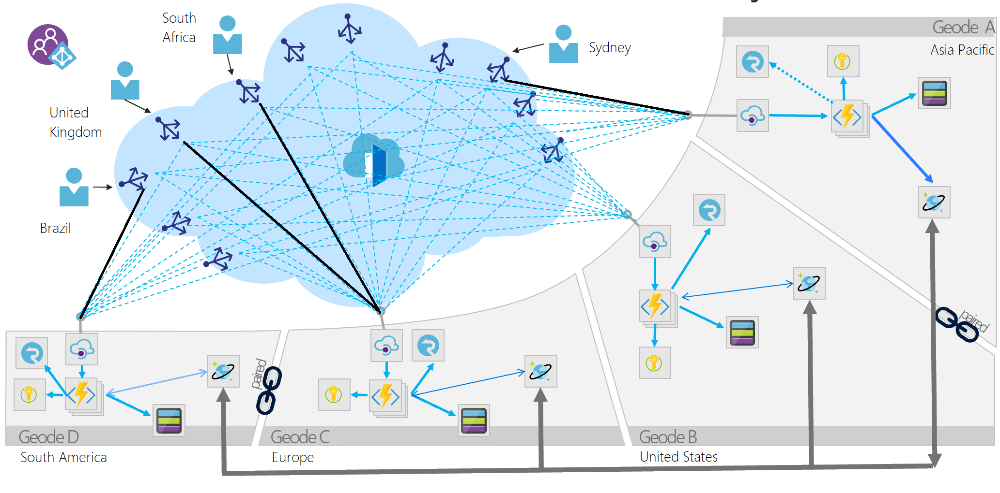
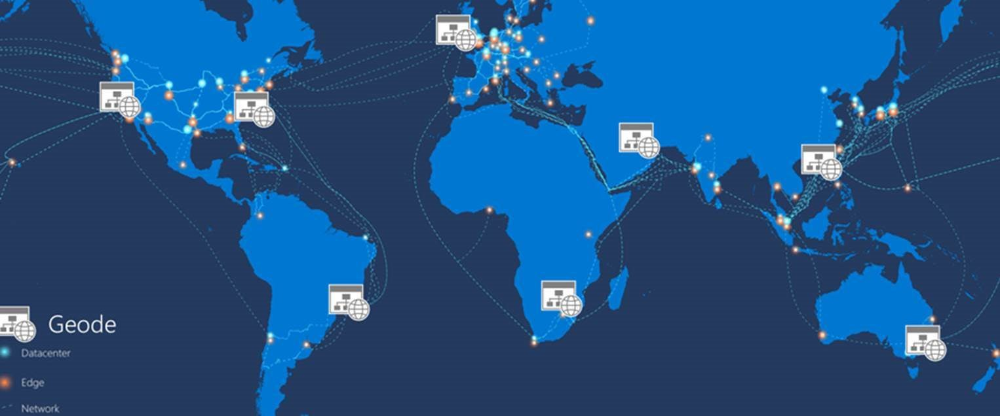

# Geodes

The geode pattern involves splicing a collection of backend services into a set of *geo*graphical no*de*s, each of which can service any request for any client in any region. This pattern enabled requests to be served in an active-active-active style, whilst distributing request processing across multiple geographies, improving latency and providing ultimate availability.

## Context and Problem

Many large-scale services have specific challenges around geo-availability and scale. Modern cloud infrastructure meanwhile has evolved to enable geographic load balancing of front-end services while allowing for geographic data replication of backend services.

In "classic" designs, we'd often *"bring the data to the compute"* by storing data in a remote SQL server, which serves as the compute tier for that data, relying on scale-up for growth.)

The geode pattern is an example whereby we'd do the reverse and *"bring the compute to the data"*. We can start with the principle that for availability and performance reasons, getting data closer to the user is good. However, when data is going to be geo-distributed across a far-flung user base, we will need to ensure these geo-distributed datastores are colocated with the compute which will process the data.

We also see this pattern occur in Big Data architectures where commodity hardware is used to process data colocated on the same machine, using map-reduce to consolidate results across machines. Another valid example is near-edge compute where we bring compute closer to the intelligent edge of the network to reduce response time, this pattern then holds true with services that can have 10's or even potentially *hundreds* of geodes. 

The classic approach may present challenges in a number of forms: 
- network latency: users coming from the other side of the globe connecting to the hosting endpoint
- traffic management: my users may have bursts in demand that can overwhelm the services in a single region
- complexity: the complexity of deploying 40 copies of my app infrastructure into multiple regions for a 24x7 service can be overwhelming and often cost-prohibitive.

The geode pattern harnesses key features of Azure to route traffic via the shortest path to the nearest endpoint to improve latency is and performance. Cloud data-replication services are used to ensure that _all_ requests can be served from _all_ geo-nodes – as their data store is identical.  

We can also use serverless and consumption-based billed technologies to reduce waste and cost from having duplicated geo-distributed deployments. Furthermore, the resiliency of the whole solution increases with each added geode, since all geodes can take over should a regional outage take one or more geodes offline.

## Solution

Split the service into a number of satellite deployments spread around the globe – each of which is called a "geode". Each geode is placed behind a global load balancer and uses a geo-replicated read-write service (Such as Azure CosmosDB) to host the data plane, ensuring cross-geo data consistency.

**Geodes enjoy the following characteristics:**
- They are a collection of disparate types of resources – often defined as a template.
- All dependencies reside within the geode footprint, no geode is dependent on another to operate
- They are loosely coupled via an edge network and replication backplane. For example, Traffic Manager or Azure Front Door can be used for fronting the geodes while Cosmos DB can act as the replication backplane.
- They are self-contained, if one dies the others continue to operate.
- These services could be deployed into an intra-zone, zonal, or regional footprint, with a mind to the regulatory or latency constraints on location.
- The key difference between a deployment stamp and a geode is that geodes never exist in isolation, there should be always more than one in a production platform.
- They are not clusters as they share a replication backplane and hence have the issues of quorum taken care of by the platform.

## Issues and Considerations

Consider the following points when deciding how to implement this pattern:
- Use a replicating data store that provides control over the data-consistency, such as Azure Cosmos DB. 
- Use a frontend service that does dynamic content acceleration, split TCP, and Anycast routing such as Azure Front Door.
- Making a deliberate choice whether to process data locally in each region or distribute making aggregations in a single geode and then replicating the result across the globe. The [Cosmos DB Change feed processor](https://docs.microsoft.com/en-us/azure/cosmos-db/change-feed-processor) offers this granular control using its "lease container" concept and the "leasecollectionprefix" in the corresponding [Azure Functions binding](https://docs.microsoft.com/en-us/azure/cosmos-db/change-feed-functions).  Each approach has distinct advantages and drawbacks.
- Use serverless technologies where possible to reduce the always-on deployment cost – especially where load gets rebalanced around the globe frequently. This strategy potentially allows for a high number of geodes to be deployed with minimal additional investment.
- This design pattern implicitly decouples everything from everywhere else, resulting in an ultra-highly distributed and decoupled architecture. Whilst decoupling is a good thing – consider how to track different components of the same request as they might execute asynchronously on different instances.  Get a good monitoring strategy in place.
- Use Autoscaling to autoscale out instances of compute and/or Database throughput within a Geode.  Each geode individually scales out, within the common backplane constraints.
- Use modern DevOps practices and tools to produce identical geodes to be rapidly deployed across a large number of separate regions or instances.
- It's also possible to combine geodes with local availability techniques (such as availability zones or paired regions) are augmented with the Geode Pattern for global availability. Though this increases complexity, it is useful if your architecture is underpinned by a storage engine such as blob storage that can only replicate to a paired region.
- Geodes can work in tandem, using Cosmos DB's change feed and a real-time communication platform like SignalR, which allows for geodes to loosely communicate with other geode’s users so the user is completely unaware they are acting as a remote part of a geo-distributed system. This concept is demonstrated in the sample voting app.

## When to use this pattern

Use this pattern: 
- anywhere you're implementing a high-scale platform that has users distributed over a wide area
- for any service that requires extreme availability and resilience characteristics, as services based on the Geode pattern can survive the loss of multiple service regions *at the same time*.

## This pattern might not be suitable for

- Architectures which have constraints so that all Geodes can't be equal for data storage. For example, there may be data residency requirements, an application that needs to maintain temporary state for a particular session, or a heavy weighting of requests towards a single region. In this case, consider using deployment stamps in combination with a global routing plane that is aware of where a user’s data sits.
- Situations where there's no geographical distribution required.  Instead consider availability zones and/or paired regions for clustering.
- Situations where a legacy platform needs to be retrofitted.  The pattern presented here works for cloud-native development only and is very difficult to retrofit.
- Very simple architectures and requirements, where geo-redundancy and geo-distribution aren't required or advantageous.

## Examples

- Windows Active Directory implements a very early variant of this pattern where multimaster replication is enabled, all updates can be served from all nodes, but the idea of FSMO roles means that all geodes aren't equal.

- There's a "QnA" sample application which showcases this design pattern in practice, find it here.  **Temporary Link until we find a better location: https://github.com/xstof/qnademo**

