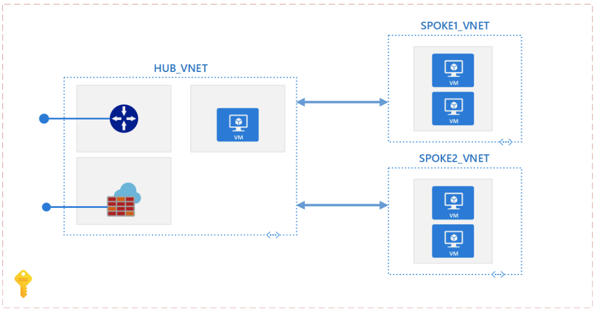
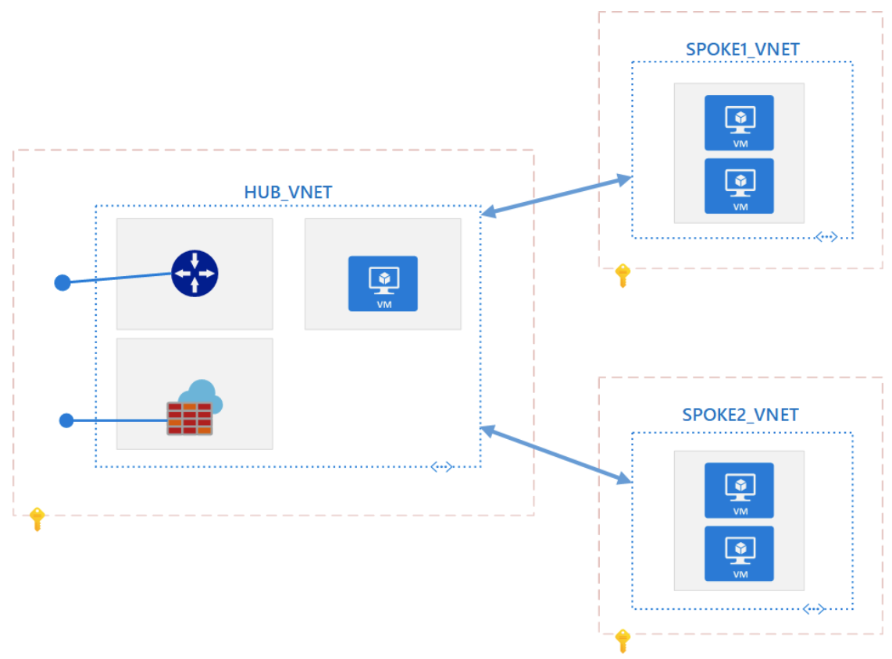

# Add IP address spaces to peered virtual networks

Many organizations deploy a virtual networking architecture that follows the [Hub and Spoke](https://docs.microsoft.com/azure/architecture/reference-architectures/hybrid-networking/hub-spoke) model. At some point, after being deployed to production, the hub virtual network might require additional IP address spaces.  Currently, address ranges can't be added or deleted from a virtual network's address space once it's peered with another virtual network.  To add or remove address ranges, delete the peering, add or remove the address ranges, then re-create the peering manually.  This change can be accomplished by different methods, such as the [Azure Portal](https://docs.microsoft.com/azure/virtual-network/virtual-network-manage-peering#delete-a-peering), [Azure PowerShell](https://docs.microsoft.com/powershell/module/az.network/remove-azvirtualnetworkpeering), or [Azure CLI](https://docs.microsoft.com/cli/azure/network/vnet/peering).  To help, we've developed a PowerShell script that can make this process easier.

## Relevant use cases

### Single subscription

A single subscription scenario where both hub and all spoke virtual networks are in the same subscription.  As demonstrated below:



### Multiple subscriptions

A single Azure Active Directory tenant, different subscriptions scenario where the hub virtual network is in one subscription and all other spoke virtual networks are in different subscriptions. As demonstrated below:



## Considerations

* The script requires the Azure PowerShell module version 1.0.0 or later. Run `Get-Module -ListAvailable Az` to find the installed version. If you need to upgrade, see [Install Azure PowerShell module](https://docs.microsoft.com/powershell/azure/install-az-ps). Run `Connect-AzAccount` to create a connection with Azure.
* Performing this exercise will result in outage or disconnections between the Hub and Spoke virtual networks.  Perform this during an approved maintenance window.
* The accounts you use to work with virtual network peering must be assigned to the [Network Contributor](https://docs.microsoft.com/azure/role-based-access-control/built-in-roles?toc=%2fazure%2fvirtual-network%2ftoc.json#network-contributor) role or a [Custom Role](https://docs.microsoft.com/azure/role-based-access-control/custom-roles) containing the necessary actions found under [virtual network peering permissions](https://docs.microsoft.com/azure/virtual-network/virtual-network-manage-peering#permissions).
* The accounts you use to add IP Address spaces must be assigned to the [Network Contributor](https://docs.microsoft.com/azure/role-based-access-control/built-in-roles?toc=%2fazure%2fvirtual-network%2ftoc.json#network-contributor) role or a [Custom Role](https://docs.microsoft.com/azure/role-based-access-control/custom-roles) containing the necessary actions found under [virtual network permissions](https://docs.microsoft.com/azure/virtual-network/manage-virtual-network#permissions).
* The IP address space you wish to add to the Hub virtual network must not overlap with any of the IP address spaces of the Spoke virtual networks that you intend to peer with the Hub virtual network.

## Add the IP address range

This script automatically removes all Virtual Network peerings from the Hub Virtual Network, adds an IP address range prefix to the Hub Virtual Network based on Input parameters, adds the Virtual Network peerings back to the Hub Virtual Network, and reconnects the Hub virtual network peerings to the existing Spoke virtual network peerings. The script will work with single and multiple subscription hub and spoke topologies.

```powershell
param (
    # Address Prefix range (CIDR Notation, e.g., 10.0.0.0/24)
    [Parameter(Mandatory = $true)]
    [ValidatePattern('^(([0-9]|[1-9][0-9]|1[0-9]{2}|2[0-4][0-9]|25[0-5])\.){3}([0-9]|[1-9][0-9]|1[0-9]{2}|2[0-4][0-9]|25[0-5])(\/(3[0-2]|[1-2][0-9]|[0-9]))$')]
    [String[]]
    $IPAddressRange,

    # Address Prefix range (Subscription ID for Hub VNet)
    [Parameter(Mandatory = $true)]
    [String]
    $HubVNetSubsID,

    # Address Prefix range (Hub VNet Resource Group Name)
    [Parameter(Mandatory = $true)]
    [String]
    $HubVNetRGName,

    # Address Prefix range (Hub VNet Name)
    [Parameter(Mandatory = $true)]
    [String]
    $HubVNetName
)

#region Set context to Hub VNet Subscription
Set-AzContext -Subscription $HubVNetSubsID
#endregion

#region Get All Hub VNet Peerings and Hub VNet Object
$hubPeerings = Get-AzVirtualNetworkPeering -ResourceGroupName $HubVNetRGName -VirtualNetworkName $HubVNetName
$hubVNet = Get-AzVirtualNetwork -Name $HubVNetName -ResourceGroupName $HubVNetRGName
#endregion

#region Remove All Hub VNet Peerings
$hubPeerings | Remove-AzVirtualNetworkPeering -Force
#endregion

#region Add IP address range to the hub vnet
$hubVNet.AddressSpace.AddressPrefixes.AddRange($IPAddressRange)
Set-AzVirtualNetwork -VirtualNetwork $hubVNet
#endregion

foreach ($vNetPeering in $hubPeerings)
{
    # Get remote vnet name
    $vNetFullId = $vNetPeering.RemoteVirtualNetwork.Id
    $vNetName = $vNetFullId.Substring($vNetFullId.LastIndexOf('/') + 1)

    # Get subscription id
    $vNetSubscriptionId = $vNetFullId.Substring($vNetFullId.IndexOf('/', 1) + 1, 36)

    if ((Get-AzContext).Subscription.Id -ne $vNetSubscriptionId)
    {
        # Set the context so that we can modify the spokes
        Set-AzContext -Subscription $vNetSubscriptionId
    }

    # Pull remote vNet object
    $vNetObj = Get-AzVirtualNetwork -Name $vNetName

    # Get the peering from the remote vnet object
    $peeringName = $vNetObj.VirtualNetworkPeerings.Where({$_.RemoteVirtualNetwork.Id -like "*$($hubVNet.Name)"}).Name
    $peering = Get-AzVirtualNetworkPeering -ResourceGroupName $vNetObj.ResourceGroupName -VirtualNetworkName $vNetName -Name $peeringName

    # Reset to initiated state
    Set-AzVirtualNetworkPeering -VirtualNetworkPeering $peering

    if ((Get-AzContext).Subscription.Id -ne $HubVNetSubsID)
    {
        # Set context so that we can recreate the peering
        Set-AzContext -Subscription $HubVNetSubsID
    }
    # Recreate peering on hub
    Add-AzVirtualNetworkPeering -Name $vNetPeering.Name -VirtualNetwork $hubvnet -RemoteVirtualNetworkId $vNetFullId -AllowGatewayTransit

}

```

## Pricing

There is a nominal charge for ingress and egress traffic that utilizes a virtual network peering. There is no change to existing pricing when adding an additional IP address space to an Azure virtual network.  For more information, see the [pricing page](https://azure.microsoft.com/pricing/details/virtual-network).

## Next Steps

* Learn more about [managing Virtual Network peerings](https://docs.microsoft.com/azure/virtual-network/virtual-network-manage-peering)

* Learn more about [managing IP Address ranges](https://docs.microsoft.com/azure/virtual-network/manage-virtual-network#add-or-remove-an-address-range) on Virtual Networks