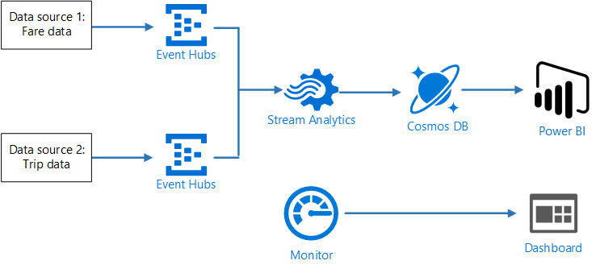
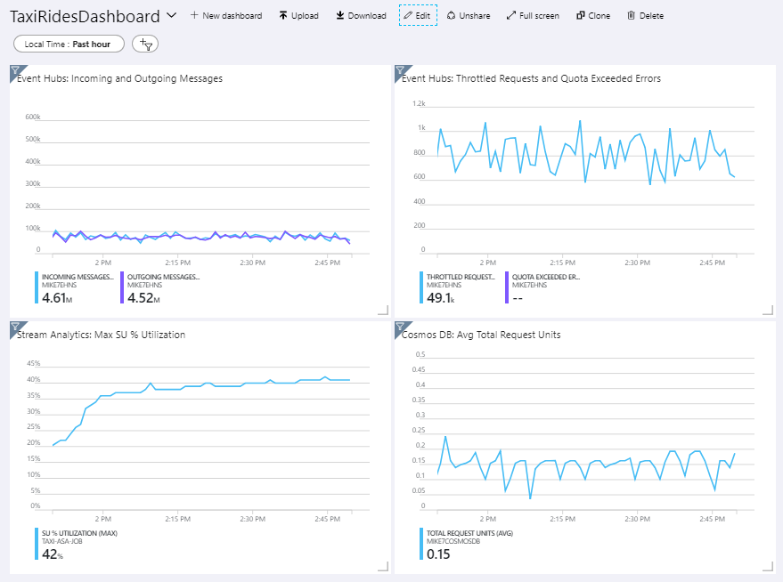
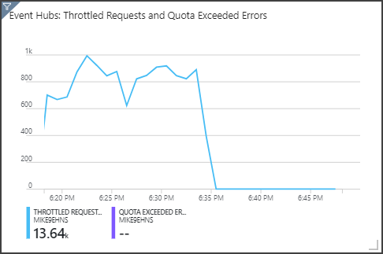

# Create a stream processing pipeline with Azure Stream Analytics

This reference architecture shows an end-to-end [stream processing](/azure/architecture/data-guide/big-data/real-time-processing) pipeline. The pipeline ingests data from two sources, correlates records in the two streams, and calculates a rolling average across a time window. The results are stored for further analysis.

 A reference implementation for this architecture is available on [GitHub][github].



**Scenario**: A taxi company collects data about each taxi trip. For this scenario, we assume there are two separate devices sending data. The taxi has a meter that sends information about each ride &mdash; the duration, distance, and pickup and dropoff locations. A separate device accepts payments from customers and sends data about fares. The taxi company wants to calculate the average tip per mile driven, in real time, in order to spot trends.

## Architecture

The architecture consists of the following components.

**Data sources**. In this architecture, there are two data sources that generate data streams in real time. The first stream contains ride information, and the second contains fare information. The reference architecture includes a simulated data generator that reads from a set of static files and pushes the data to Event Hubs. In a real application, the data sources would be devices installed in the taxi cabs.

**Azure Event Hubs**. [Event Hubs](/azure/event-hubs/) is an event ingestion service. This architecture uses two event hub instances, one for each data source. Each data source sends a stream of data to the associated event hub.

**Azure Stream Analytics**. [Stream Analytics](/azure/stream-analytics/) is an event-processing engine. A Stream Analytics job reads the data streams from the two event hubs and performs stream processing.

**Cosmos DB**. The output from the Stream Analytics job is a series of records, which are written as JSON documents to a Cosmos DB document database.

**Microsoft Power BI**. Power BI is a suite of business analytics tools to analyze data for business insights. In this architecture, it loads the data from Cosmos DB. This allows users to analyze the complete set of historical data that's been collected. You could also stream the results directly from Stream Analytics to Power BI for a real-time view of the data. For more information, see [Real-time streaming in Power BI](/power-bi/service-real-time-streaming).

**Azure Monitor**. [Azure Monitor](/azure/monitoring-and-diagnostics/) collects performance metrics about the Azure services deployed in the solution. By visualizing these in a dashboard, you can get insights into the health of the solution.

## Data ingestion

<!-- markdownlint-disable MD033 -->

To simulate a data source, this reference architecture uses the [New York City Taxi Data](https://uofi.app.box.com/v/NYCtaxidata/folder/2332218797) dataset<sup>[[1]](#note1)</sup>. This dataset contains data about taxi trips in New York City over a four-year period (2010&ndash;2013). It contains two types of record: ride data and fare data. Ride data includes trip duration, trip distance, and pickup and dropoff location. Fare data includes fare, tax, and tip amounts. Common fields in both record types include medallion number, hack license, and vendor ID. Together these three fields uniquely identify a taxi plus a driver. The data is stored in CSV format.

<span id="note1">[1]</span> Donovan, Brian; Work, Dan (2016): New York City Taxi Trip Data (2010-2013). University of Illinois at Urbana-Champaign. https://doi.org/10.13012/J8PN93H8

<!-- markdownlint-enable MD033 -->

The data generator is a .NET Core application that reads the records and sends them to Azure Event Hubs. The generator sends ride data in JSON format and fare data in CSV format.

Event Hubs uses [partitions](/azure/event-hubs/event-hubs-features#partitions) to segment the data. Partitions allow a consumer to read each partition in parallel. When you send data to Event Hubs, you can specify the partition key explicitly. Otherwise, records are assigned to partitions in round-robin fashion.

In this particular scenario, ride data and fare data should end up with the same partition ID for a given taxi cab. This enables Stream Analytics to apply a degree of parallelism when it correlates the two streams. A record in partition *n* of the ride data will match a record in partition *n* of the fare data.


In the data generator, the common data model for both record types has a `PartitionKey` property which is the concatenation of `Medallion`, `HackLicense`, and `VendorId`.

```csharp
public abstract class TaxiData
{
    public TaxiData()
    {
    }

    [JsonProperty]
    public long Medallion { get; set; }

    [JsonProperty]
    public long HackLicense { get; set; }

    [JsonProperty]
    public string VendorId { get; set; }

    [JsonProperty]
    public DateTimeOffset PickupTime { get; set; }

    [JsonIgnore]
    public string PartitionKey
    {
        get => $"{Medallion}_{HackLicense}_{VendorId}";
    }
```

This property is used to provide an explicit partition key when sending to Event Hubs:

```csharp
using (var client = pool.GetObject())
{
    return client.Value.SendAsync(new EventData(Encoding.UTF8.GetBytes(
        t.GetData(dataFormat))), t.PartitionKey);
}
```

## Stream processing

The stream processing job is defined using a SQL query with several distinct steps. The first two steps simply select records from the two input streams.

```sql
WITH
Step1 AS (
    SELECT PartitionId,
           TRY_CAST(Medallion AS nvarchar(max)) AS Medallion,
           TRY_CAST(HackLicense AS nvarchar(max)) AS HackLicense,
           VendorId,
           TRY_CAST(PickupTime AS datetime) AS PickupTime,
           TripDistanceInMiles
    FROM [TaxiRide] PARTITION BY PartitionId
),
Step2 AS (
    SELECT PartitionId,
           medallion AS Medallion,
           hack_license AS HackLicense,
           vendor_id AS VendorId,
           TRY_CAST(pickup_datetime AS datetime) AS PickupTime,
           tip_amount AS TipAmount
    FROM [TaxiFare] PARTITION BY PartitionId
),
```

The next step joins the two input streams to select matching records from each stream.

```sql
Step3 AS (
  SELECT
         tr.Medallion,
         tr.HackLicense,
         tr.VendorId,
         tr.PickupTime,
         tr.TripDistanceInMiles,
         tf.TipAmount
    FROM [Step1] tr
    PARTITION BY PartitionId
    JOIN [Step2] tf PARTITION BY PartitionId
      ON tr.Medallion = tf.Medallion
     AND tr.HackLicense = tf.HackLicense
     AND tr.VendorId = tf.VendorId
     AND tr.PickupTime = tf.PickupTime
     AND tr.PartitionId = tf.PartitionId
     AND DATEDIFF(minute, tr, tf) BETWEEN 0 AND 15
)
```

This query joins records on a set of fields that uniquely identify matching records (Medallion, HackLicense, VendorId, and PickupTime). The `JOIN` statement also includes the partition ID. As mentioned, this takes advantage of the fact that matching records always have the same partition ID in this scenario.

In Stream Analytics, joins are *temporal*, meaning records are joined within a particular window of time. Otherwise, the job might need to wait indefinitely for a match. The [DATEDIFF](https://msdn.microsoft.com/azure/stream-analytics/reference/join-azure-stream-analytics) function specifies how far two matching records can be separated in time for a match.

The last step in the job computes the average tip per mile, grouped by a hopping window of 5 minutes.

```sql
SELECT System.Timestamp AS WindowTime,
       SUM(tr.TipAmount) / SUM(tr.TripDistanceInMiles) AS AverageTipPerMile
  INTO [TaxiDrain]
  FROM [Step3] tr
  GROUP BY HoppingWindow(Duration(minute, 5), Hop(minute, 1))
```

Stream Analytics provides several [windowing functions](/azure/stream-analytics/stream-analytics-window-functions). A hopping window moves forward in time by a fixed period, in this case 1 minute per hop. The result is to calculate a moving average over the past 5 minutes.

In the architecture shown here, only the results of the Stream Analytics job are saved to Cosmos DB. For a big data scenario, consider also using [Event Hubs Capture](/azure/event-hubs/event-hubs-capture-overview) to save the raw event data into Azure Blob storage. Keeping the raw data will allow you to run batch queries over your historical data at later time, in order to derive new insights from the data.

## Scalability considerations

### Event Hubs

The throughput capacity of Event Hubs is measured in [throughput units](/azure/event-hubs/event-hubs-features#throughput-units). You can autoscale an event hub by enabling [auto-inflate](/azure/event-hubs/event-hubs-auto-inflate), which automatically scales the throughput units based on traffic, up to a configured maximum.

### Stream Analytics

For Stream Analytics, the computing resources allocated to a job are measured in Streaming Units. Stream Analytics jobs scale best if the job can be parallelized. That way, Stream Analytics can distribute the job across multiple compute nodes.

For Event Hubs input, use the `PARTITION BY` keyword to partition the Stream Analytics job. The data will be divided into subsets based on the Event Hubs partitions.

Windowing functions and temporal joins require additional SU. When possible, use `PARTITION BY` so that each partition is processed separately. For more information, see [Understand and adjust Streaming Units](/azure/stream-analytics/stream-analytics-streaming-unit-consumption#windowed-aggregates).

If it's not possible to parallelize the entire Stream Analytics job, try to break the job into multiple steps, starting with one or more parallel steps. That way, the first steps can run in parallel. For example, in this reference architecture:

- Steps 1 and 2 are simple `SELECT` statements that select records within a single partition.
- Step 3 performs a partitioned join across two input streams. This step takes advantage of the fact that matching records share the same partition key, and so are guaranteed to have the same partition ID in each input stream.
- Step 4 aggregates across all of the partitions. This step cannot be parallelized.

Use the Stream Analytics [job diagram](/azure/stream-analytics/stream-analytics-job-diagram-with-metrics) to see how many partitions are assigned to each step in the job. The following diagram shows the job diagram for this reference architecture:


### Cosmos DB

Throughput capacity for Cosmos DB is measured in [Request Units](/azure/cosmos-db/request-units) (RU). In order to scale a Cosmos DB container past 10,000 RU, you must specify a [partition key](/azure/cosmos-db/partition-data) when you create the container, and include the partition key in every document.

In this reference architecture, new documents are created only once per minute (the hopping window interval), so the throughput requirements are quite low. For that reason, there's no need to assign a partition key in this scenario.

## Monitoring considerations

With any stream processing solution, it's important to monitor the performance and health of the system. [Azure Monitor](/azure/monitoring-and-diagnostics/) collects metrics and diagnostics logs for the Azure services used in the architecture. Azure Monitor is built into the Azure platform and does not require any additional code in your application.

Any of the following warning signals indicate that you should scale out the relevant Azure resource:

- Event Hubs throttles requests or is close to the daily message quota.
- The Stream Analytics job consistently uses more than 80% of allocated Streaming Units (SU).
- Cosmos DB begins to throttle requests.

The reference architecture includes a custom dashboard, which is deployed to the Azure portal. After you deploy the architecture, you can view the dashboard by opening the [Azure portal](https://portal.azure.com) and selecting `TaxiRidesDashboard` from list of dashboards. For more information about creating and deploying custom dashboards in the Azure portal, see [Programmatically create Azure Dashboards](/azure/azure-portal/azure-portal-dashboards-create-programmatically).

The following image shows the dashboard after the Stream Analytics job ran for about an hour.



The panel on the lower left shows that the SU consumption for the Stream Analytics job climbs during the first 15 minutes and then levels off. This is a typical pattern as the job reaches a steady state.

Notice that Event Hubs is throttling requests, shown in the upper right panel. An occasional throttled request is not a problem, because the Event Hubs client SDK automatically retries when it receives a throttling error. However, if you see consistent throttling errors, it means the event hub needs more throughput units. The following graph shows a test run using the Event Hubs auto-inflate feature, which automatically scales out the throughput units as needed.



Auto-inflate was enabled at about the 06:35 mark. You can see the p drop in throttled requests, as Event Hubs automatically scaled up to 3 throughput units.

Interestingly, this had the side effect of increasing the SU utilization in the Stream Analytics job. By throttling, Event Hubs was artificially reducing the ingestion rate for the Stream Analytics job. It's actually common that resolving one performance bottleneck reveals another. In this case, allocating additional SU for the Stream Analytics job resolved the issue.

## Deploy the solution

To the deploy and run the reference implementation, follow the steps in the [GitHub readme][github].

## Related resources

You may wish to review the following [Azure example scenarios](/azure/architecture/example-scenario) that demonstrate specific solutions using some of the same technologies:

- [IoT and data analytics in the construction industry](/azure/architecture/example-scenario/data/big-data-with-iot)
- [Real-time fraud detection](/azure/architecture/example-scenario/data/fraud-detection)

<!-- links -->

[github]: https://github.com/mspnp/azure-stream-analytics-data-pipeline
