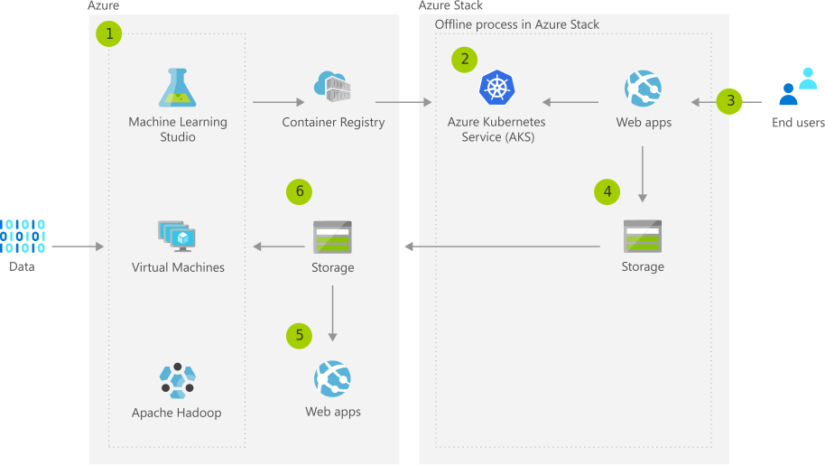

# AI at the Edge with Azure Stack - disconnected

[!INCLUDE [header_file](../header.md)]

With the Azure AI tools and cloud platform, the next generation of AI-enabled hybrid applications can run where your data lives. With Azure Stack, bring a trained AI model to the edge and integrate it with your applications for low-latency intelligence, with no tool or process changes for local applications. With Azure Stack, you can ensure that your cloud solutions work even when disconnected from the internet.

## Architecture

## Data Flow

1. Data scientists train a model using Azure Machine Learning and an HDInsight cluster. The model is containerized and put in to an Azure Container Registry.
1. The model is deployed via an offline installer to a Kubernetes cluster on Azure Stack.
1. End users provide data that is scored against the model.
1. Insights and anomalies from scoring are placed into storage for later upload.
1. Globally-relevant and compliant insights are available in the global app.
1. Data from edge scoring is used to improve the model.

## Components
* [HDInsight](https://azure.microsoft.com/services/hdinsight/): Provision cloud Hadoop, Spark, R Server, HBase, and Storm clusters
* [Machine Learning Studio](https://azure.microsoft.com/services/machine-learning-studio/): Easily build, deploy, and manage predictive analytics solutions
* [Virtual Machines](https://azure.microsoft.com/services/virtual-machines/): Provision Windows and Linux virtual machines in seconds
* [Azure Kubernetes Service (AKS)](https://azure.microsoft.com/services/kubernetes-service/): Simplify the deployment, management, and operations of Kubernetes
* [Storage](https://azure.microsoft.com/services/storage/): Durable, highly available, and massively scalable cloud storage
* [Azure Stack](https://azure.microsoft.com/overview/azure-stack/): Build and run innovative hybrid applications across cloud boundaries

## Next Steps
* [HDInsight documentation](/azure/hdinsight/)
* [Machine Learning Studio documentation](/azure/machine-learning/studio/)
* [Virtual Machines documentation](/azure/virtual-machines/workloads/sap/get-started?toc=%2Fazure%2Fvirtual-machines%2Fwindows%2Fclassic%2Ftoc.json)
* [Azure Kubernetes Service (AKS) documentation](/azure/aks/)
* [Storage documentation](/azure/storage/)
* [Azure Stack documentation](/azure/azure-stack/user/azure-stack-solution-machine-learning)

