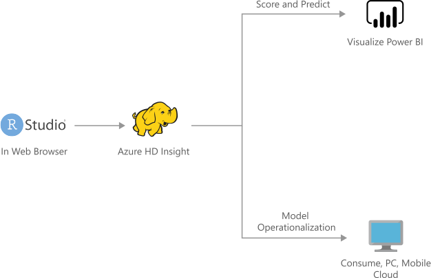

# Campaign Optimization with Azure HDInsight Spark Clusters

[!INCLUDE [header_file](../header.md)]

This solution demonstrates how to build and deploy a machine learning model with Microsoft R Server on Azure HDInsight Spark clusters to recommend actions to maximize the purchase rate of leads targeted by a campaign. This solution enables efficient handling of big data on Spark with Microsoft R Server.

## Architecture

## Description

This solution will create an HDInisght Spark cluster with Microsoft R Server. This cluster will contain 2 head nodes, 2 worker nodes, and 1 edge node with a total of 32 cores. The approximate cost for this HDInsight Spark cluster is $8.29/hour. Billing starts once a cluster is created and stops when the cluster is deleted. Billing is pro-rated per minute, so you should always delete your cluster when it is no longer in use. Use the Deployments page to delete the entire solution once you are done.

## Overview

When a business launches a marketing campaign to interest customers in new or existing product(s), they often use a set of business rules to select leads for their campaign to target. Machine learning can be used to help increase the response rate from these leads. This solution demonstrates how to use a model to predict actions that are expected to maximize the purchase rate of leads targeted by the campaign. These predictions serve as the basis for recommendations to be used by a renewed campaign on how to contact (for example, e-mail, SMS, or cold call) and when to contact (day of week and time of day) the targeted leads. The solution presented here uses simulated data from the insurance industry to model responses of the leads to the campaign. The model predictors include demographic details of the leads, historical campaign performance, and product-specific details. The model predicts the probability that each lead in the database makes a purchase from a channel, on each day of the week at various times of day. Recommendations on which channel, day of week and time of day to use when targeting users are based then on the channel and timing combination that the model predicts will have the highest probability a purchase being made.

## Business Perspective

This solution employs machine learning leveraging historical campaign data to predict customer responses and recommend when and how to connect with your leads. The recommendations include the best channel to contact a lead (in our example, email, SMS, or cold call), the best day of the week and the best time of day in which to make the contact.

Microsoft R Server on HDInsight Spark clusters provides distributed and scalable machine learning capabilities for big data, leveraging the combined power of R Server and Apache Spark. This solution demonstrates how to develop machine learning models for marketing campaign optimization (including data processing, feature engineering, training and evaluating models), deploy the models as a web service (on the edge node) and consume the web service remotely with Microsoft R Server on Azure HDInsight Spark clusters. The final predictions and recommendation table are saved to a Hive table containing recommendations for how and when to contact each lead. This data is then visualized in Power BI.

Power BI also presents visual summaries of the effectiveness of the campaign recommendations (shown here with simulated data). You can try out this dashboard by clicking the Try it Now button to the right.

The Recommendations tab of this dashboard shows the predicted recommendations. At the top is a table of individual leads for our new deployment. This includes fields for the lead ID, campaign and product, populated with leads on which our business rules are to be applied. This is followed by the model predictions for the leads, giving the optimal channel and time to contact each one, along with the estimated probabilities that the leads will buy our product using these recommendations. These probabilities can be used to increase the efficiency of the campaign by limiting the number of leads contacted to the subset most likely to buy.

Also on the Recommendations tab are various summaries of recommendations and demographic information on the leads. The Campaign Summary tab of the dashboard shows summaries of the historical data used to create the predicted recommendations. While this tab also shows values of Day of Week, Time of Day, and Channel, these values are actual past observations, not to be confused with the recommendations from the model, shown on the Recommendations tab.

## Data Scientist Perspective

This solution demonstrates the end-to-end process of how to develop and deploy machine learning models for marketing campaign optimization. It contains sample data, R code for each step of building the model (including data processing, feature engineering, training and evaluating models along with sample data), deploying the model as a web service (on the edge node) and consuming the web service remotely with Microsoft R Server on Azure HDInsight Spark clusters.

Data scientists who are testing this solution can work with the provided R code from the browser-based Open Source Edition of RStudio Server that runs on the Edge Node of the Azure HDInsight Spark cluster. By [setting the compute context]({0}) the user can decide where the computation will be performed: locally on the edge node, or distributed across the nodes in the Spark cluster. All the R code can also be found in public Github repository. Have fun!

