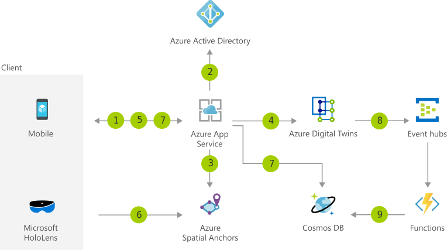

# Facilities management powered by mixed reality and IoT

[!INCLUDE [header_file](../header.md)]

Improve uptime and operations in hospitality, manufacturing, retail, and more with mixed reality and IoT. This scenario shows how you can visualize a virtual replica of your physical space with real-time data in the context of your environment. It is built on [Azure Spatial Anchors](https://azure.microsoft.com/services/spatial-anchors/) and [Azure Digital Twins](https://azure.microsoft.com/services/digital-twins/).

## Architecture

## Data Flow

1. The client authenticates to the facilities management web service and specifies the name of the space where it's located in the Azure Digital Twins object model.
1. The client's web service authenticates itself to Azure Active Directory.
1. The Azure AD token is then sent to the Azure Spatial Anchors service to retrieve an access token for the client to later use.
1. Your app service retrieves information about the IoT sensors present in the area specified by the client and returns IoT sensor IDs, as well as the anchor IDs they correspond to in Azure Spatial Anchors.
1. The Azure Spatial Anchors authorization token is returned to the client alongside the anchor IDs of the IoT sensors and additional metadata required by the client application.
1. The client application completes a visual scan of the environment and retrieves its position in the area. Using the nearby API of Azure Spatial Anchors, it retrieves the position of all nearby anchors.
1. The client application requests IoT sensor data and controls to be displayed as holograms in the space, where the sensors are located, making it easy for the operator to detect and fix any issues. The data is fetched by the app's web service from Azure Cosmos DB, the service storing this data.
1. When IoT sensor data is updated, Azure Digital Twins pushes it to Event Hubs.
1. Azure Functions uses an Event Hubs trigger to process the change and update data in Azure Cosmos DB as needed.

## Components
* [Spatial Anchors](https://azure.microsoft.com/services/spatial-anchors/): Create multi-user, spatially aware mixed reality experiences
* [Azure Active Directory](https://azure.microsoft.com/services/active-directory/): Synchronize on-premises directories and enable single sign-on
* [Azure Cosmos DB](https://azure.microsoft.com/services/cosmos-db/): Globally distributed, multi-model database for any scale
* [App Service](https://azure.microsoft.com/services/app-service/): Quickly create powerful cloud apps for web and mobile
* [Event Hubs](https://azure.microsoft.com/services/event-hubs/): Receive telemetry from millions of devices
* [Azure Digital Twins](https://azure.microsoft.com/services/digital-twins/): Build next-generation IoT spatial intelligence solutions

## Next Steps
* [Share Spatial Anchors across devices](/azure/spatial-anchors/tutorials/tutorial-share-anchors-across-devices)
* [Create a new tenant in Azure Active Directory](/azure/active-directory/fundamentals/active-directory-access-create-new-tenant)
* [Build a .NET web app with Azure Cosmos DB using the SQL API and the Azure portal](/azure/cosmos-db/create-sql-api-dotnet)
* [Authenticate and authorize users end-to-end in Azure App Service](/azure/app-service/app-service-web-tutorial-auth-aad)
* [Azure Event Hubs — A big data streaming platform and event ingestion service](/azure/event-hubs/event-hubs-about)
* [Deploy Azure Digital Twins and configure a spatial graph](/azure/digital-twins/tutorial-facilities-setup)

