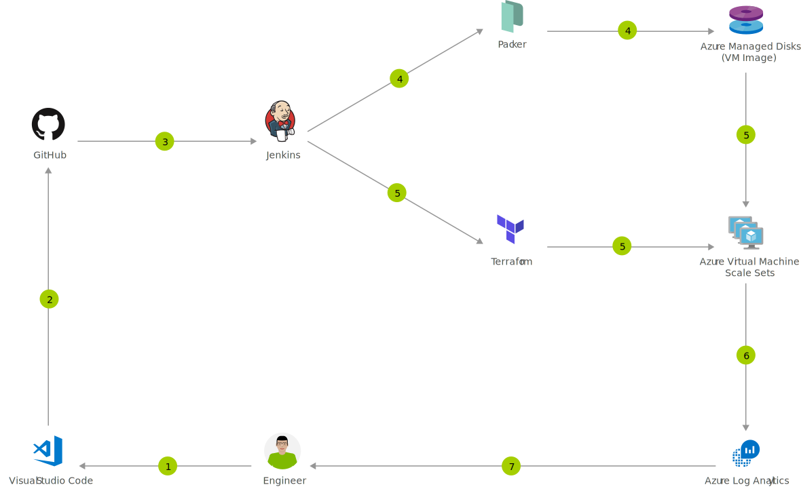

# Immutable Infrastructure CI/CD using Jenkins and Terraform on Azure Virtual Architecture overview

[!INCLUDE [header_file](../header.md)]

Azure is a world-class cloud for hosting virtual machines running Windows or Linux. Whether you use Java, Node.js, Go, or PHP to develop your applications, you'll need a continuous integration and continuous deployment (CI/CD) pipeline to push changes to these virtual machines automatically.

## Architecture

## Data Flow

1. Change application source code.
1. Commit code to GitHub.
1. Continuous Integration Trigger to Jenkins.
1. Jenkins triggers a Packer image build to create a VM and stores it as a VM image using Azure Managed Disks.
1. Jenkins triggers Terraform to provision a new Virtual Machine Scale Set using the Azure Managed Disks VM image.
1. Azure Log Analytics collects and analyzes logs.
1. Monitor application and make improvements.

## Components

* [Managed Disks](https://azure.microsoft.com/services/managed-disks): Persistent, secured disk storage for Azure virtual machines.
* [Virtual Machine Scale Sets](https://azure.microsoft.com/services/virtual-machine-scale-sets): Manage and scale up to thousands of Linux and Windows virtual machines.
* Log Analytics: Collect, search, and visualize machine data from on-premises and cloud.
* [Visual Studio Code](https://azure.microsoft.com/products/visual-studio): Build and deploy multi-platform apps to get the most from Azure services.

## Next steps

* [Use Terraform to create a Virtual Machine Scale Set from a Packer customer VM image](https://docs.microsoft.com/azure/terraform/terraform-create-vm-scaleset-network-disks-using-packer-hcl)
* [Use Terraform to plan and create a Virtual Machine Scale Set with Managed Disk](https://docs.microsoft.com/azure/terraform/terraform-create-vm-scaleset-network-disks-hcl)
* [Use Log Analytics to collect data from Linux computers](https://docs.microsoft.com/azure/log-analytics/log-analytics-quick-collect-linux-computer)
* [Get the Azure Extensions Pack for Visual Studio Code](https://marketplace.visualstudio.com/items?itemName=ms-vscode.vscode-azureextensionpack)

## Deploy to Azure

* [Deploy to Azure](https://azure.microsoft.com/resources/templates/jenkins-cicd-vmss)
