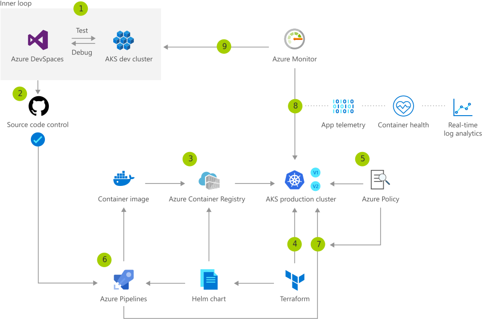

# Secure DevOps for AKS

[!INCLUDE [header_file](../header.md)]

DevOps and Kubernetes are better together. Implementing secure DevOps together with Kubernetes on Azure, you can achieve the balance between speed and security and deliver code faster at scale. Put guardrails around the development processes using CI/CD with dynamic policy controls and accelerate feedback loop with constant monitoring. Use Azure Pipelines to deliver fast while ensuring enforcement of critical policies with Azure Policy. Azure provides you real-time observability for your build and release pipelines, and the ability to apply compliance audit and reconfigurations easily.

## Architecture

Developers rapidly iterate, test, and debug different parts of an application together in

the same Kubernetes cluster

Code is merged into a GitHub repository, after which automated builds and tests are

run by Azure Pipelines

Kubernetes clusters are provisioned using tools like Terraform; Helm charts, installed

by Terraform, define the desired state of app resources and configurations

Release pipeline automatically executes pre-defined deployment strategy with each

code change

App telemetry, container health monitoring, and real-time log analytics are obtained

using Azure Monitor

## Data Flow

1. Developers rapidly iterate, test, and debug different parts of an application together in

the same Kubernetes cluster
1. Code is merged into a GitHub repository, after which automated builds and tests are

run by Azure Pipelines
1. Container image is registered in Azure Container Registry
1. Kubernetes clusters are provisioned using tools like Terraform; Helm charts, installed

by Terraform, define the desired state of app resources and configurations
1. Operators enforce policies to govern deployments to the AKS cluster
1. Release pipeline automatically executes pre-defined deployment strategy with each

code change
1. Policy enforcement and auditing is added to CI/CD pipeline using Azure Policy
1. App telemetry, container health monitoring, and real-time log analytics are obtained

using Azure Monitor
1. Insights used to address issues and fed into next sprint plans

