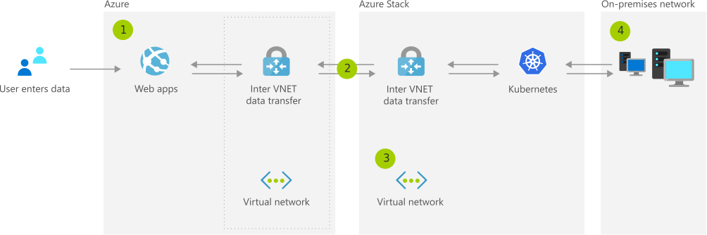

# Unlock Legacy Data with Azure Stack

[!INCLUDE [header_file](../header.md)]

Use Azure Stack to update and extend your legacy application data with the latest cloud technology such as Azure web services, containers, serverless computing, and microservices architectures. This is a solution to create new applications while integrating and preserving legacy data in mainframe and core business process applications.

## Architecture

## Data Flow

1. User enters data into Azure-based web app.
1. Application commits data to database over virtual network-to-virtual network VPN connection to Azure Stack.
1. Data is processed by applications running on a Kubernetes cluster on Azure Stack.
1. Kubernetes cluster communicates with legacy system on corporate network.

## Components
* [Virtual Network](https://azure.microsoft.com/services/virtual-network/): Provision private networks, optionally connect to on-premises datacenters
* [VPN Gateway](https://azure.microsoft.com/services/vpn-gateway/): Establish secure, cross-premises connectivity

## Next Steps
* [Virtual Network documentation](https://azure.microsoft.com/services/virtual-network/)
* [VPN Gateway documentation](https://azure.microsoft.com/services/vpn-gateway/)

